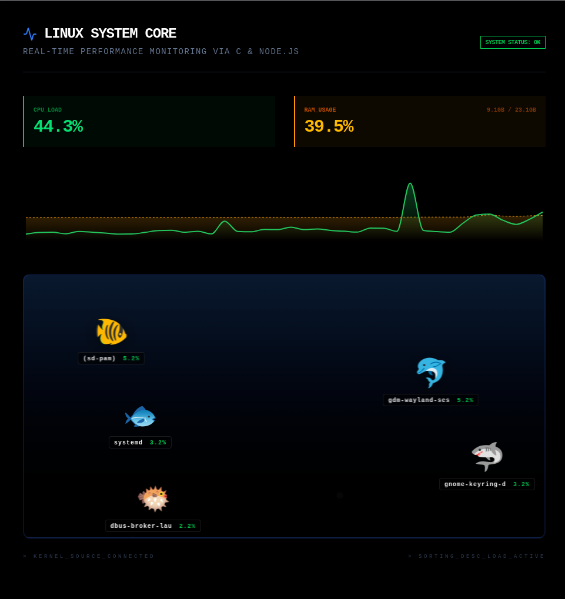

# Linux System Monitor Aquarium



This project is a real-time system resource monitor for Linux that visualizes system processes as an aquarium. It consists of a high-performance C backend, a Node.js relay server, and a React frontend.

## Architecture

The system operates using a three-tier pipeline:

1. **Backend (C)**
   Reads system metrics directly from `/proc/stat` and `/proc/meminfo`. Outputs real-time data as a JSON stream to `stdout`.

2. **Relay (Node.js)**
   Receives the JSON stream via a Unix pipe and broadcasts data to clients using Socket.IO.

3. **Frontend (React)**
   A web dashboard that renders processes as a dynamic aquarium, featuring real-time charts and prioritized process sorting.

## Prerequisites

* GCC compiler
* Node.js (v18 or higher)
* npm or yarn
* Linux environment (required for `/proc` access)

## Project Structure

* `monitor.c` – C source code for system telemetry
* `backend/server.js` – Node.js WebSocket relay server
* `frontend/` – React application source code
* `start.sh` – Automation script for system execution

## Installation

Follow these steps to set up the project locally:

1. **Clone the repository**

   ```bash
   git clone https://github.com/1Filipek2/linux-system-monitor.git
   cd linux-system-monitor
   ```

2. **Install frontend dependencies**

   ```bash
   cd frontend
   npm install
   cd ..
   ```

3. **Install backend dependencies**

   ```bash
   cd backend
   npm install
   cd ..
   ```

## Usage

```bash
chmod +x start.sh
./start.sh
```
